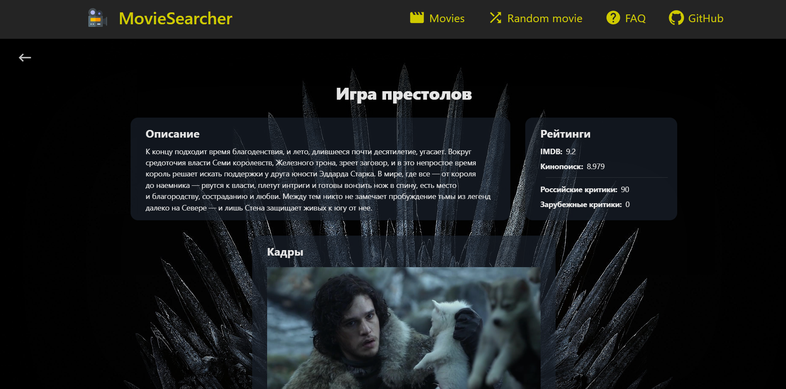

# Изображения

](public/image.png)

](public/image-1.png)

# Запуск проекта

Live-версию проекта можно посмотреть здесь: https://master--movie-searcher-v1.netlify.app

Локально этот проект запускается стандартным образом через команды Create React App (CRA):

#### `npm start` - запуск в dev-режиме

#### `npm run build` - сборка проекта

По умолчанию CRA разворачивает проект на 3000 порту. Чтобы изменить порт, следует в папке с проектом создать файл `.env` с указанием `PORT=<НУЖНЫЙ_ПОРТ>`. Например, если Вы хотите, чтобы сервер был развернут на 7070 порту, стоит написать `PORT=7070`.

<b>ВАЖНО:</b> для корректной работы программы следует указать API-ключ от сервиса https://api.kinopoisk.dev/documentation#/Фильмы%2C%20сериалы%2C%20и%20т.д./MovieController_findOneV1_4

Чтобы это сделать, в папке с проектом надо создать файл `.env` (если он ранее уже не был создан) и написать
`REACT_APP_API_KEY=<your api token>`

# Общая информация

Приложение дает возможность пользователю искать кинокартины согласно выставленным критериям поиска. Картины можно искать как по названию, так и по различным фильтрам:

<ul>
    <li>По году;</li>
    <li>По странам;</li>
    <li>По возрастному рейтингу;</li>
</ul>

Пользователь также может получить подробную информацию о картине при клике на ее карточку.
Возможные ошибки со стороны API обрабатываются - при неудачном запросе пользователь увидит на сайте соответствующее предупреждение.

# Дополнительные возможности

В приложении есть страница, на которой можно получить случайный фильм, исходя из выставленных значений фильтров.

<ul className="py-4">
<li>По жанру;</li>
<li>По типу картины (фильм/сериал/...);</li>
<li>По сети производства (HBO, Netflix, ...);</li>
<li>По рейтингу в кинопоиске;</li>
</ul>

<b>ВАЖНО</b>: для того, чтобы воспользоваться случайным поиском, необходимо предварительно авторизоваться
(авторизация состоит из ввода имени пользователя и пароля - кнопка для авторизации находится в <b>правом нижнем
углу экрана</b>).

<b>Имя пользователя:</b> <i>elshappo</i>\
<b>Пароль:</b> <i>42</i>

# Особенности реализации

<ul>
    <li>
        Все фильтры, которые выставляет пользователь, сохраняются в поисковой строке, поэтому страницами с
        результатами фильтрации можно легко обмениваться;
    </li>
    <li>
        Когда пользователь ищет картины по их названию, перед отправкой запроса к API срабатывает тайм-аут в 1
        секунду (debounce);
    </li>
</ul>

# Стек технологий

Данное приложение написано на <b>React 18</b> на языке <b>TypeScript</b> с использованием стейт-менеджера
<b>MobX</b>, фреймворка для стилей <b>TailwindCSS</b>, а также UI-библиотеки <b>Ant Design</b>. Пагинация
реализована с помощью <b>React Router V6</b>.
